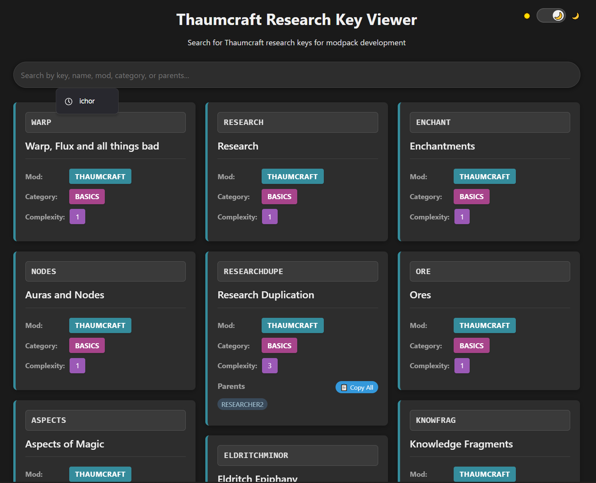
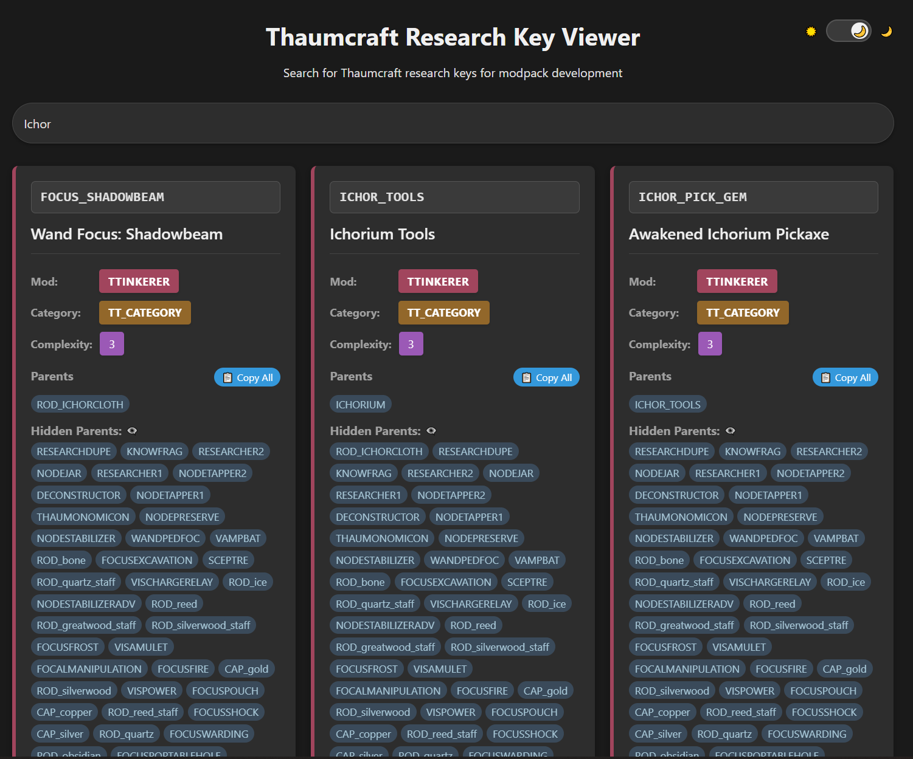
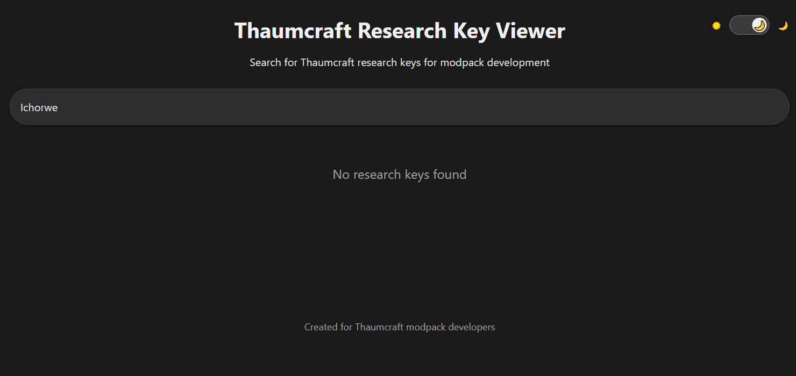
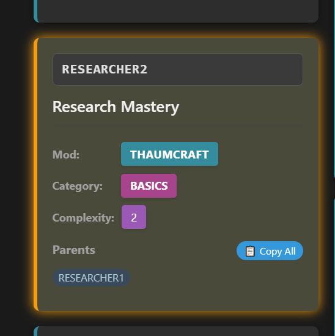

Бывало ли у вас такое, что вы создаете кастомные исследования в таумономиконе, хотите сделать их зависимыми от уже существующих исследований, но не знаете их ключей? Тогда этот сайт для вас! Данный сайт разработан с целью помочь создателям модпаков/серверов, которые хотят создавать свои исследования. В нем собрана большая база исследований Thaumcraft и его различных аддонов.

Сам сайт:  [Thaumcraft Research Helper](<https://007killer2.github.io/Thaumcraft-Research-Helper/>)
Исходный код:  [Github](<https://github.com/007killer2/Thaumcraft-Research-Helper>)

Список модов, что присутствуют в базе:
- Thaumcraft
- Forbidden Magic
- Electro-Magic-Tools
- Tainted Magic
- Gadomancy
- Automagy
- Forgotten Relics
- Railcraft
- Thaumic Additions
- Thaumic Tinkerer
- Thaumic Horizons
- Thaumic Bases
- Thaumic Exploration
- Thaumic Dyes
- Thaumic Warden
- Thaum Ores
- Witching Gadgets
- Thaumic Expansion
- ThaumicRevelations
- Thaumic Boots
- Thaumic Concilium
- ThaumicThermae
- ManaMetal Mod
- Essentia Pipes
- Magical Decorations
- Alfheim
- Pumpkifiction
- Magic Cookies
- Cybersus
- Thaumcraft Recipes
- Ars Magica 2
    - AM2 Playground
-  Immersive Engineering
    -  Arcane Engineering
- Witchery
    - Deathly Hallows
- Forestry
    - Magic Bees
- Applied Energistics 2
    - Thaumic Energistics
- Blood Magic
    - Blood Arsenal
- Baubles
    - Baubles Stuff
- EssentialCraft 3
    - Essential Thaumaturgy

Очень высокая вероятность, что в списке не все модификации, однако все самые основные уже имеются.

Буду очень рад, если этот сайт будет для кого-то актуален и упростит работу.

P.S. Отдельная благодарность @sainthozier за помощь с оформлением сайта.

Внешний вид сайта:

Фильтрация списка по ключу:

Исследование не найдено:

Подсветка исследования родителя:

Копирование ключей исследований:

